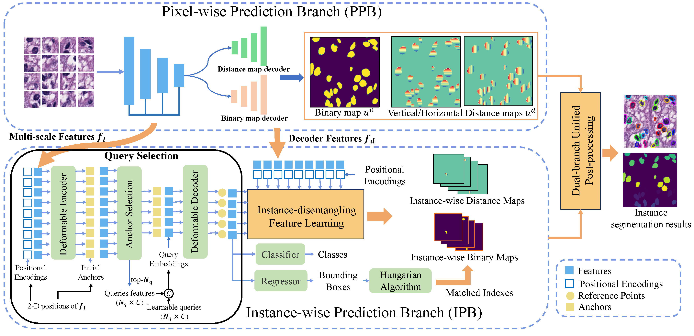

# Instance-aware Multi-task Learning for Nuclei Segmentation (IML)
This is the official PyTorch implementation of IML, a instance-aware multi-task learning framework that strengthens a pixel-wise prediction branch with an instance-wise prediction branch. The whole framework includes four key components: 1) a pixel-wise prediction branch, 2) an instance-wise prediction branch with an instance-disentangling feature learning module, 3) a dualbranch synchronizing training scheme, and 4) a dual-branch unified post-processing algorithm.

Part of the codes are from the implementation of [DINO](https://github.com/IDEA-Research/DINO).

> **If you intend to use anything from this repo, citation of the original publication given above is necessary**



## Set Up Environment
```
conda install -c pytorch pytorch torchvision
pip install -r requirements.txt
cd models/dino/ops
python setup.py build install
```

## Datasets
- [TNBC](https://pubmed.ncbi.nlm.nih.gov/30716022/)
- [PanNuke](https://arxiv.org/abs/2003.10778)
- [MoNuSAC](https://ieeexplore.ieee.org/abstract/document/8880654)

The pretrained-models can be downloaded from this link:
https://pan.baidu.com/s/1qMiJiNAg8QtHCgMlZXtdxA?pwd=gzkx  

# Running the Code
Before training, please convert the instance segmentation annotation into [COCO json format](https://cocodataset.org/).
## Training
```
CUDA_VISIBLE_DEVICES=0 python -m torch.distributed.launch --nproc_per_node=1 --master_port=25611 main.py \
	 --output_dir OUTPUTS -c config/DINO/DINO_4scale_swin.py --coco_path COCO_DATA/ \
	--options dn_scalar=100 embed_init_tgt=TRUE \
	dn_label_coef=1.0 dn_bbox_coef=1.0 use_ema=False \
	dn_box_noise_scale=1.0 backbone_dir=BACKBONE/

```

## Inference
```
python inference_tnbc.py
```

## Citation
